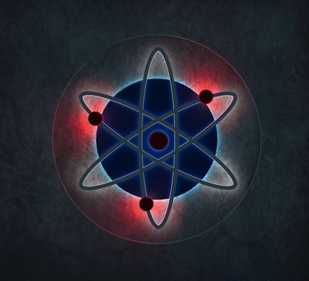

                                              Sejá Bem vindo!

  &nbsp;
  &nbsp;
  
_ _ _

<li><a class="link_name" href="https://github.com/HACKS-EXE/HACKS-EXE/tree/main/PLUTONIUM/WORD%20AT%20WAR/SERVIDORES">🖥 Servidor WORD AT WAR</a></li>

<li><a class="link_name" href="https://github.com/HACKS-EXE/HACKS-EXE/tree/main/PLUTONIUM/CALL%20OF%20DUTY%20BLACK%20OPS/SERVIDORES">🖥 Servidor Call of Duty black ops</a></li>

<li><a class="link_name" href="https://github.com/HACKS-EXE/HACKS-EXE/tree/main/PLUTONIUM/CALL%20OF%20DUTY%20BLACK%20OPS%202/SERVIDORES">🖥 Servidor Call of Duty black ops 2</a></li>

<li><a class="link_name" href="https://github.com/HACKS-EXE/HACKS-EXE/tree/main/PLUTONIUM/MODERN%20WARFARE%203/SERVIDORES/MULTIJOGADOR">🖥 Servidor Modern Warfare 3</a></li>

<li><a class="link_name" href="https://github.com/HACKS-EXE/HACKS-EXE/tree/main/PLUTONIUM">🖥 Servidores Para jogos</a></li>

<li><a class="link_name" href="https://github.com/HACKS-EXE/SERVIDORES/releases/tag/Servidores">🚀 Baixar</a></li>
